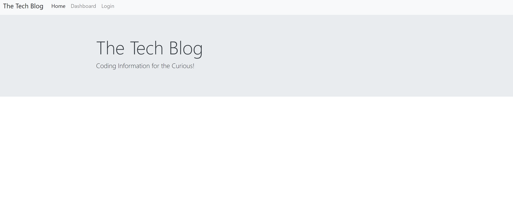
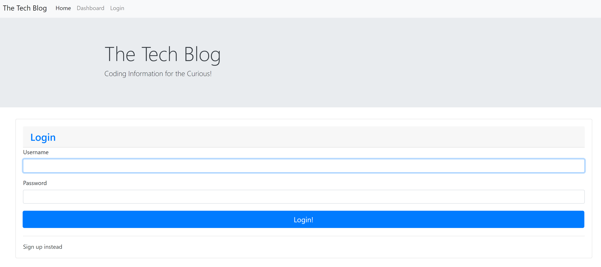
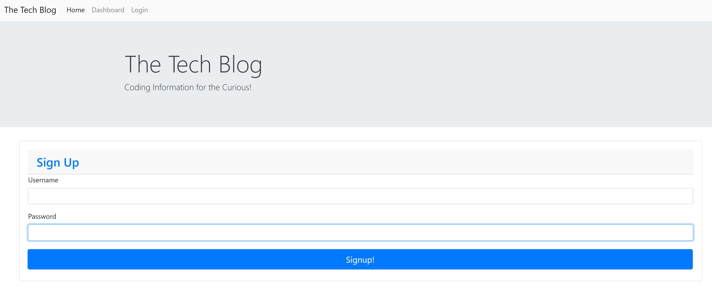
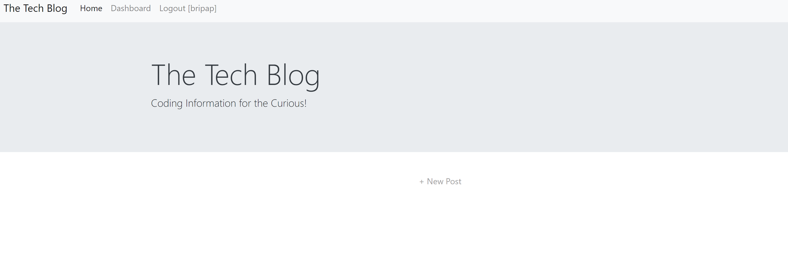
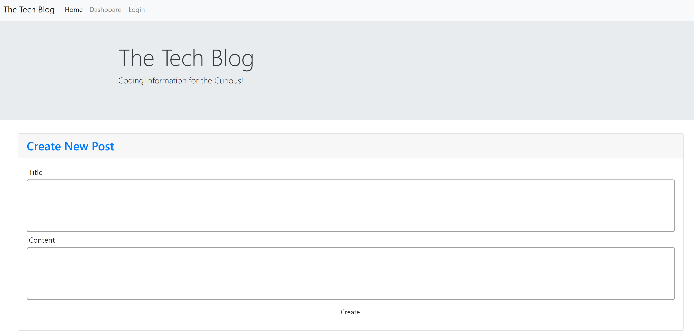
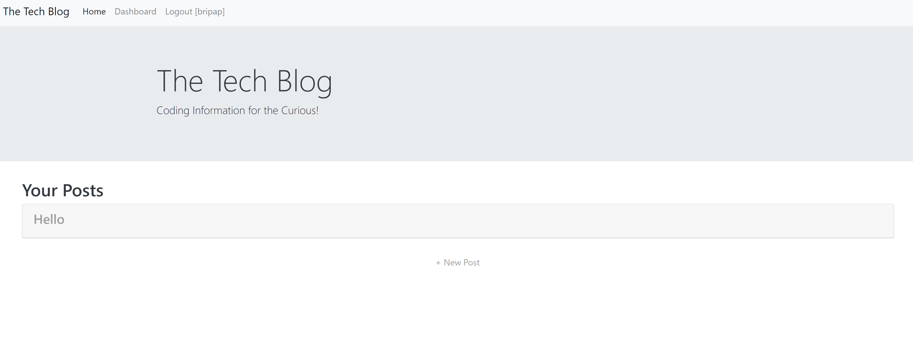
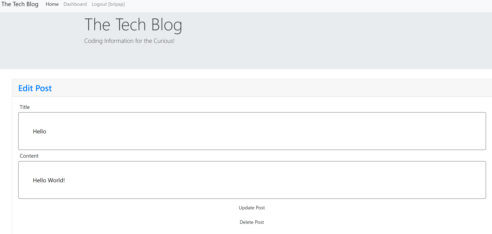

# 14 Model-View-Controller (MVC): Tech Blog

## Task

Build a CMS-style blog site similar to a Wordpress site, where developers can publish their blog posts and comment on other developers’ posts as well COMPLETELY FROM SCRATCH. Deploy it to Heroku. The app will follow the MVC paradigm in its architectural structure, using Handlebars.js as the templating language, Sequelize as the ORM, and the express-session npm package for authentication.

## User Story

```md
AS A developer who writes about tech
I WANT a CMS-style blog site
SO THAT I can publish articles, blog posts, and my thoughts and opinions
```

## Final product:

### HOME PAGE


### LOGIN PAGE


### SIGN UP PAGE


### LOGGED IN 


### CREATE A NEW POST


### NEW POST CREATED


### OPENED NEW POST


## Links

 [Github](https://github.com/bripap)  
 [Heroku](https://polar-chamber-71511.herokuapp.com/)


